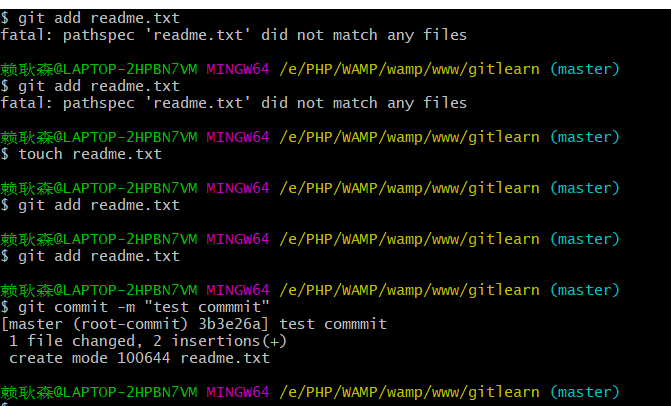
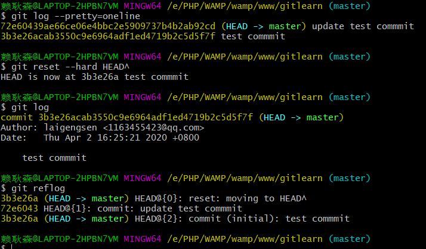

# 创建版本库

##### 创建

mkdir 库名

##### 进入

cd库名

##### 进入的操作

pwd显示当前目录

ls 查看文件列表

##### 初始化

git init  （变成可管理的库）

##### 设置忽略规则


##### 创建文件（txt）

touch 文件名.后缀

##### 文件添加到暂存区

git add 文件名.后缀  （添加单一文件）

git add --all	（添加文件夹下的所有文件）

##### 文件提交到仓库

git commit -m "提交的说明"



# 版本控制

##### 查看提交日志

git log

##### 过滤日志信息

git log --pretty=oneline

##### 版本回退

git reset --hard HEAD^   (回退一个版本)

git reset --hard HEAD^^^^   (回退四个版本)

git reset --hard HEAD~n   (回退n个版本)

git reset --hard 1939fda...(commit id)   (回退指定版本)

##### 查看命令日志

git reflog



##### 查看文件的状态

git status

##### 撤销修改

git checkout -- 文件名.后缀

撤销对暂存区文件的修改


### 小结

`git add`把文件添加进去，实际上就是把文件修改添加到暂存区；

`git commit`提交更改，实际上就是把暂存区的所有内容提交到当前分支。


命令`git checkout -- readme.txt`意思就是，把`readme.txt`文件在工作区的修改全部撤销，这里有两种情况：

一种是`readme.txt`自修改后还没有被放到暂存区，现在，撤销修改就回到和版本库一模一样的状态；

一种是`readme.txt`已经添加到暂存区后，又作了修改，现在，撤销修改就回到添加到暂存区后的状态。

总之，就是让这个文件回到最近一次`git commit`或`git add`时的状态。

# 远程仓库

##### 进行关联

git remote add origin git@github.com:(用户名)/(项目名).git

##### 推送至github远程库

git push -u origin master（也可以是其他分支名）

 由于远程库是空的，我们第一次推送`master`分支时，加上了`-u`参数，Git不但会把本地的`master`分支内容推送的远程新的`master`分支，还会把本地的`master`分支和远程的`master`分支关联起来，在以后的推送或者拉取时就可以简化命令。 

再次提交：git push origin master

##### 克隆远程仓库

git clone git@github.com:(用户名)/(项目名).git

##### 查看远程仓库

git remote   或   git remote -v(更详细)

##### rebase(理解为格式化？)

git rebase

# 分支

##### 创建dev分支

git checkout -b dev

加上`-b`参数表示创建并切换，相当于以下两条命令： 

git branch dev

git checkout dev


注意新版写法：git switch -c dev

加上`-b`参数表示创建并切换，相当于以下两条命令： 

git branch dev

git switch dev


##### 查看当前分支

git branch


##### 切换分支

git checkout 分支名

注意新版：git swich 分支名


##### 合并到master

git merge dev(可以是其他分支)

把指定的分支合并到当前分支

注意：默认fast forward模式 但会丢失分支信息 

​			可强制禁用该模式 

​			命令：git merge --no-ff -m "merge with no-ff" dev

​			（回顾：-m为添加描述）


##### 删除分支

git branch -d dev(分支名称) 

（此方法不能删除未合并的分支，可把-d改-D强制删除）


##### bug分支(贮藏stash)(hotfix分支)

也可以理解为stash缓存？

git stash 功能 可把当前工作进行贮藏，待之后恢复

git stash list 查看贮藏的工作


##### 恢复贮藏stash的记录

一：git stash apply  (恢复但不删除stash内容)

​		git stash drop  (删除stash中的记录)

二：git stash pop  （恢复的同时删除stash内容）


# 标签

创建的标签都只存储在本地 不会自动推送到远程 可安全删除

##### 创建：

git tag (标签名)  

会给当前的分支写上标签名


git tag (标签名)  (commit id)

可给历史提交的commit id 打上标签


git tag -a (标签名) -m "说明" (commit id)

还可以创建带有说明的标签，用`-a`指定标签名，`-m`指定说明文字

 

##### 查看：

git tag  查看所有的标签


git show v1.0(标签名)

可查看该标签名下的信息


##### 删除

git tag -d 标签名

删除本地标签名


git push origin :ref/tags/标签名

删除远程仓库的标签名 不过要事先删除本地对应标签


##### 推送到远程

git push origin 标签名

推送指定标签名


git push origin tags

将未推送的全部进行推送


# 总结

##### 概念性的东西

主分支 Master

紧急修复分支Hotfix

发布分支 Release

开发分支 Develop

功能分支 Feature  (只与dev有交集 理解为在dev分支上开发新功能用 的)


##### 区分add . 和add all

两者都可以将工作区中所有未跟踪或者修改的文件添加到暂存区。

但是两者还是有一些区别的，下面分别做一下介绍：

**一.版本导致的差别：**

1.x版本：

（1）.git add all可以提交未跟踪、修改和删除文件。

（2）.git add .可以提交未跟踪和修改文件，但是不处理删除文件。

2.x版本：

两者功能在提交类型方面是相同的。

二.所在目录不同导致的差异：

（1）.git add all无论在哪个目录执行都会提交相应文件。

（2）.git add .只能够提交当前目录或者它后代目录下相应文件。


# 开发规范

>  https://juejin.im/post/5b4328bbf265da0fa21a6820 

## 分支管理

### 分支命名

**master 分支**

- master 为主分支，也是用于部署生产环境的分支，确保master分支稳定性
- master 分支一般由develop以及hotfix分支合并，任何时间都不能直接修改代码

**develop 分支**

- develop 为开发分支，始终保持最新完成以及bug修复后的代码
- 一般开发的新功能时，feature分支都是基于develop分支下创建的

**feature 分支**

- 开发新功能时，以develop为基础创建feature分支
- 分支命名: feature/ 开头的为特性分支， 命名规则: feature/user_module、 feature/cart_module

**release分支**

- release 为预上线分支，发布提测阶段，会release分支代码为基准提测

```
当有一组feature开发完成，首先会合并到develop分支，进入提测时，会创建release分支。
如果测试过程中若存在bug需要修复，则直接由开发者在release分支修复并提交。
当测试完成之后，合并release分支到master和develop分支，此时master为最新代码，用作上线。
复制代码
```

**hotfix 分支**

- 分支命名: hotfix/ 开头的为修复分支，它的命名规则与 feature 分支类似
- 线上出现紧急问题时，需要及时修复，以master分支为基线，创建hotfix分支，修复完成后，需要合并到master分支和develop分支

### 常见任务

**增加新功能**

```
(dev)$: git checkout -b feature/xxx            # 从dev建立特性分支
(feature/xxx)$: blabla                         # 开发
(feature/xxx)$: git add xxx
(feature/xxx)$: git commit -m 'commit comment'
(dev)$: git merge feature/xxx --no-ff          # 把特性分支合并到dev
复制代码
```

**修复紧急bug**

```
(master)$: git checkout -b hotfix/xxx         # 从master建立hotfix分支
(hotfix/xxx)$: blabla                         # 开发
(hotfix/xxx)$: git add xxx
(hotfix/xxx)$: git commit -m 'commit comment'
(master)$: git merge hotfix/xxx --no-ff       # 把hotfix分支合并到master，并上线到生产环境
(dev)$: git merge hotfix/xxx --no-ff          # 把hotfix分支合并到dev，同步代码
复制代码
```

**测试环境代码**

```
(release)$: git merge dev --no-ff             # 把dev分支合并到release，然后在测试环境拉取并测试
复制代码
```

**生产环境上线**

```
(master)$: git merge release --no-ff          # 把release测试好的代码合并到master，运维人员操作
(master)$: git tag -a v0.1 -m '部署包版本名'  #给版本命名，打Tag
复制代码
```


## 日志规范

> 在一个团队协作的项目中，开发人员需要经常提交一些代码去修复bug或者实现新的feature。而项目中的文件和实现什么功能、解决什么问题都会渐渐淡忘，最后需要浪费时间去阅读代码。但是好的日志规范commit messages编写有帮助到我们，它也反映了一个开发人员是否是良好的协作者。

**编写良好的Commit messages可以达到3个重要的目的：**

- 加快review的流程
- 帮助我们编写良好的版本发布日志
- 让之后的维护者了解代码里出现特定变化和feature被添加的原因

**目前，社区有多种 Commit message 的写法规范。来自Angular 规范是目前使用最广的写法，比较合理和系统化。如下图：**


### Commit messages的基本语法

当前业界应用的比较广泛的是 [Angular Git Commit Guidelines](https://github.com/angular/angular.js/blob/master/DEVELOPERS.md#-git-commit-guidelines)

具体格式为:

```
<type>: <subject>
<BLANK LINE>
<body>
<BLANK LINE>
<footer>
复制代码
```

- type: 本次 commit 的类型，诸如 bugfix docs style 等
- scope: 本次 commit 波及的范围
- subject: 简明扼要的阐述下本次 commit 的主旨，在原文中特意强调了几点 1. 使用祈使句，是不是很熟悉又陌生的一个词，来传送门在此 祈使句 2. 首字母不要大写 3. 结尾无需添加标点
- body: 同样使用祈使句，在主体内容中我们需要把本次 commit 详细的描述一下，比如此次变更的动机，如需换行，则使用 |
- footer: 描述下与之关联的 issue 或 break change，详见案例

**Type的类别说明：**

- feat: 添加新特性
- fix: 修复bug
- docs: 仅仅修改了文档
- style: 仅仅修改了空格、格式缩进、都好等等，不改变代码逻辑
- refactor: 代码重构，没有加新功能或者修复bug
- perf: 增加代码进行性能测试
- test: 增加测试用例
- chore: 改变构建流程、或者增加依赖库、工具等

### Commit messages格式要求

```
# 标题行：50个字符以内，描述主要变更内容
#
# 主体内容：更详细的说明文本，建议72个字符以内。 需要描述的信息包括:
#
# * 为什么这个变更是必须的? 它可能是用来修复一个bug，增加一个feature，提升性能、可靠性、稳定性等等
# * 他如何解决这个问题? 具体描述解决问题的步骤
# * 是否存在副作用、风险? 
#
# 如果需要的化可以添加一个链接到issue地址或者其它文档
复制代码
```

## 

# 自行测验

 https://learngitbranching.js.org/ 